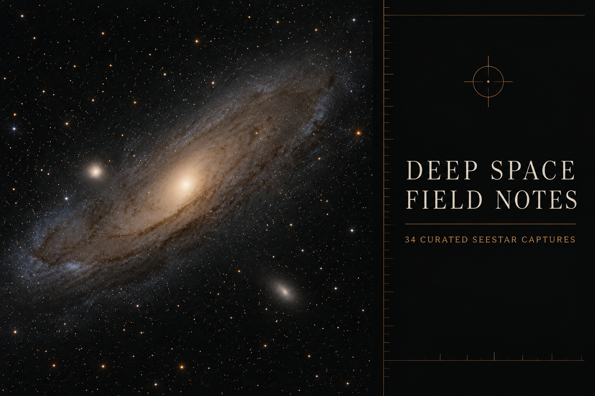

# Deep Space Field Notes

**A cinematic observatory journal built from real astrophotography captured under Northern Michigan skies.**

[Explore the live collection](https://deep-space-field-notes.vjgwrz72pz.chatgpt.site/)



## The idea

An observing session can produce hundreds of files: short exposures, partial stacks, alternate edits, and multiple attempts at the same target. The photograph worth sharing is often buried inside that archive, and a folder full of filenames does little to convey what it felt like to stand outside and aim a telescope into the dark.

Deep Space Field Notes turns that archive into an experience.

Each stop pairs one carefully selected image with its place in the sky, capture details, processing history, and a concise astronomical story. Moving to the next image feels like pulling back from the telescope, crossing the night sky, and settling onto a new target—not paging through a conventional photo grid.

## What the product does

- Presents one deep-sky capture at a time, giving every image room to breathe.
- Connects each photograph to its constellation and catalog position.
- Explains what the viewer is seeing in approachable field notes.
- Preserves useful observing context, including frame count, exposure, filter, date, and processing method.
- Supports buttons, arrow keys, and mobile swipes for a natural gallery experience.
- Lets visitors blink between the selected gallery edit and our NightSkyAI
  restack in the same viewport, then vote for the treatment they prefer.
- Uses a cinematic Northern Michigan observatory setting to keep the viewer grounded beneath the same sky where the images were captured.

The current collection includes **33 observations** spanning galaxies, nebulae, supernova remnants, and globular clusters.

## From telescope to field note

The collection follows a deliberate curation path:

1. Find the strongest stacked image for each observing folder or target.
2. Exclude stacks with fewer than 50 frames, where noise and weak signal tend to overwhelm the subject.
3. Prefer a finished image from a hand-processed `proc` folder when one exists.
4. Otherwise, apply conservative color correction and histogram work to reduce strong red or green casts without inventing detail.
5. Keep the original capture untouched and publish only the selected processed result.
6. When catalog aliases or repeat visits produce more than one public image of
   the same target, use the local review desk to select one personal favorite.
7. Reject an automated restack if alignment would crop away most of the field,
   then retry with full-field framing before it can enter the comparison set.
8. Match the NightSkyAI star field to the Gallery edit's orientation and crop,
   without changing the Gallery reference or overwriting the full-field source.
9. Add catalog coordinates, capture metadata, and an accessible astronomical field note.

The result is not intended to compete with professional observatory imagery. It is a living record of what a small smart telescope can reveal from a backyard in Northern Michigan—and a more inviting way to share that record with other people.

The complete workflow is available in **[From Seestar Drive to Deep Space Field Note](docs/AUTOMATION_GUIDE.md)**. It includes two paths through the same local automation: a guided
Codex flow that combines the collection, cleanup, FITS stacking, review, and
alignment skills, and a copy-ready command-line flow for running the same
processing and validation without Codex. Public Sites hosting remains a
separate release step. Both paths keep the telescope archive read-only,
write private working data under ignored `work/`, and separate local
preparation from public release.

## The open processing experiment

For 28 observations, visitors can switch instantly between two finished
interpretations: the gallery's existing Seestar or hand-finished edit and a
fresh stack produced by our repeatable command-line pipeline, NightSkyAI.
NightSkyAI can combine more accepted frames across multiple observing nights,
so this is an honest comparison of complete results rather than a controlled
same-light processing test. The interface shows its observation span and night
count whenever that version is active.

Before publication, a deterministic star-pattern audit detects rotation,
reflection, scale, and framing differences in every pair. The Gallery edit is
the immutable reference; a separate NightSkyAI derivative is registered onto
that field so blinking between treatments compares the same stars in the same
orientation. Black borders honestly identify portions of the Gallery field
that were not present in the NightSkyAI source. The original 1080 × 1920
NightSkyAI export remains unchanged alongside the derivative, and the audit
records hashes, the fitted transform, matched-star evidence, and a second-pass
verification result. Newly aligned comparisons default to the Gallery edit
until they are reviewed again. Neither version is hidden. Seeing both in the same frame makes
differences in field coverage, color, contrast, noise, and detail much easier
to judge than a side-by-side desktop layout.

After comparing, a visitor can cast one anonymous browser vote per observation.
The browser receives a random private identifier; only its one-way hash is
stored, and the choice can be changed later. Aggregate results appear only
after that browser votes, reducing the temptation to follow the crowd. The
counts represent browsers, not verified people. This is an informal public
poll, not a scientific image-quality benchmark. A comparison ID incorporates
both image hashes, so changing either treatment starts a fresh fair poll while
retaining the older rows as historical data.

## Honest sky travel

The transitions between observations follow each target's catalog coordinates, so the direction and relative movement are grounded in the real celestial map. The horizon and observatory scene are cinematic rather than a live planetarium calculation: they do not claim to reproduce the exact altitude, direction, season, or time of night for every capture.

## Design principles

- **Observation before interface.** The photograph remains the focal point.
- **Context without a textbook.** Field notes favor clear, memorable explanations.
- **Quality over volume.** Weak stacks stay out of the public collection.
- **Transparent processing.** Every image is labeled as hand processed or color corrected.
- **Mobile first, desktop considered.** Portrait captures remain immersive on a phone while the wider observatory view gives them presence on larger screens.
- **Motion with restraint.** Sky travel adds a sense of place and respects reduced-motion preferences.

## Run it locally

Requires Node.js 22.13 or newer.

```bash
npm install
npm run dev
```

Then open the local address shown in the terminal. To validate a production build:

```bash
npm test
```

The optional alignment audit uses NumPy and Pillow. The checked-in manifest
already points to verified derivatives, so the routine check is:

```bash
python3 -m pip install -r requirements-alignment.txt
python3 scripts/audit_comparison_alignment.py verify --gallery .
```

Run `audit` only against a freshly exported, unaligned comparison manifest.
It is report-only by default; `apply` writes new derivatives and never
overwrites either input image. The script refuses to re-audit an already
aligned manifest as if its derivative were fresh source material.

## Project map

- `app/page.tsx` contains the curated observation catalog and gallery experience.
- `app/comparisons.ts` binds stable captures to hash-versioned comparison IDs,
  preventing votes on obsolete pixels from leaking into a new comparison.
- `app/comparisons.generated.json` is the build-safe projection of the public comparison manifest; refresh it with `npm run comparisons:sync` after exporting new comparisons.
- `app/api/votes/` stores changeable anonymous votes and returns aggregates.
- `app/globals.css` defines the cinematic observatory presentation and sky-travel motion.
- `public/images/` contains the selected processed captures.
- `public/comparisons/` contains the immutable NightSkyAI comparison export and provenance manifest.
- `gallery_cull_groups.json` defines repeated targets for the local one-winner
  review queue; `review_candidates/` holds local-review-only comparison
  candidates that are never served by the public site.
- `scripts/audit_comparison_alignment.py` performs the deterministic,
  fail-closed star-field audit and produces verified aligned derivatives.
- `db/schema.ts` and `drizzle/` define the small vote database.
- `tests/` checks the collection, interactions, descriptions, and required media.

## Photography

Astrophotography © Brian Jean. The images are shared here as part of Deep Space Field Notes; please ask before reusing or redistributing the original image assets.
